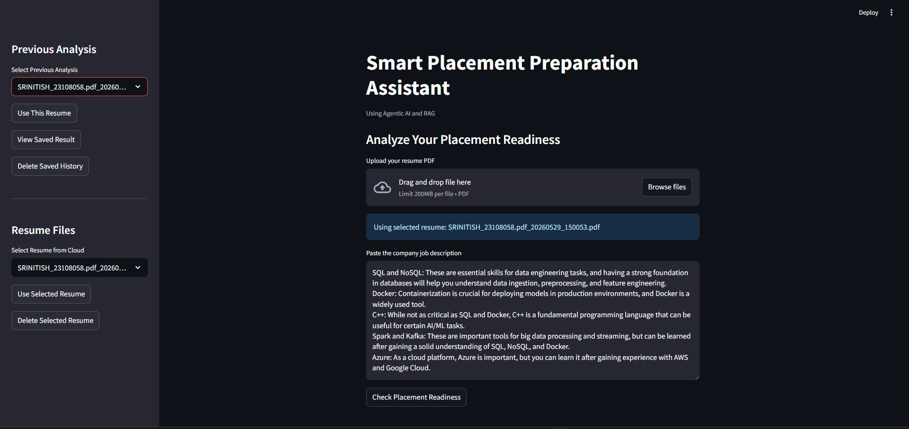
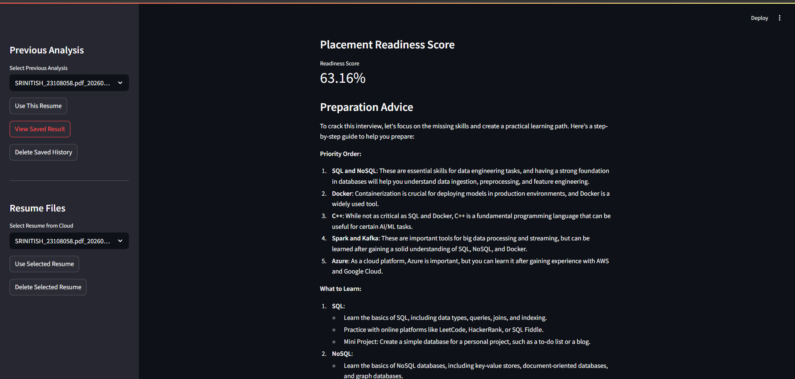
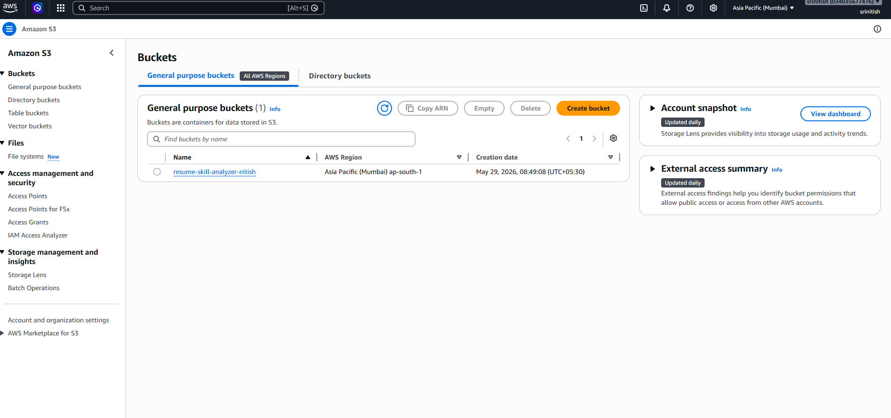
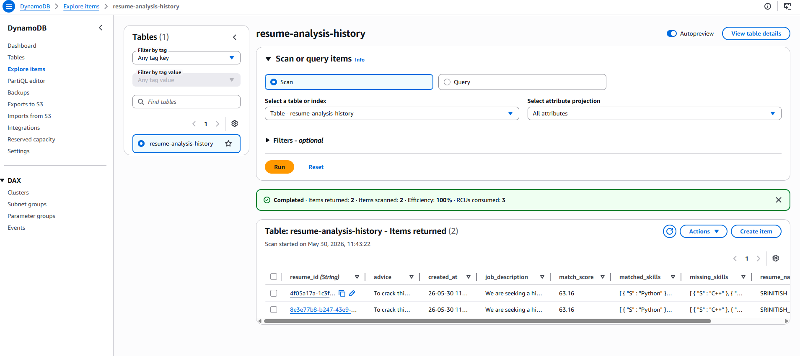

# Smart Placement Preparation Assistant using Agentic AI and RAG

An AI-powered placement preparation system that helps students analyze their resume against a company job description, identify skill gaps, calculate placement readiness scores, and receive a personalized preparation roadmap to crack interviews.

---

## Overview

**Smart Placement Preparation Assistant** is an AI-driven career readiness platform designed to help students prepare for company placements.

The system compares a student's resume with a company's job description and identifies:

* Matched skills
* Missing skills
* Placement readiness score
* Personalized learning roadmap

The project uses **Agentic AI + Retrieval-Augmented Generation (RAG)** to perform intelligent resume analysis and career guidance.

---

## Key Features

✅ Resume Upload and Analysis
✅ Technical Skill Extraction from Job Description
✅ Resume Skill Matching using RAG
✅ Placement Readiness Score Calculation
✅ Missing Skill Detection
✅ Personalized Learning Roadmap
✅ Resume Storage using AWS S3
✅ Analysis History using DynamoDB
✅ Resume Reuse from Cloud History
✅ Delete Resume from S3
✅ Delete Saved Analysis History

---

## Tech Stack

### Frontend

* Streamlit

### AI & LLM

* LangGraph
* LangChain
* Groq LLM
* Sentence Transformers
* ChromaDB

### Cloud Services

* AWS S3
* AWS DynamoDB
* AWS IAM

### Backend

* Python
* Boto3
* PyPDF

---

## System Architecture

```text
User Upload Resume + Job Description
                │
                ▼
       Resume Stored in AWS S3
                │
                ▼
     Resume Retrieved from S3
                │
                ▼
       Resume Processing (RAG)
                │
                ▼
 ┌─────────────────────────────┐
 │ Agent 1: JD Skill Extractor │
 └─────────────────────────────┘
                │
                ▼
 ┌─────────────────────────────┐
 │ Agent 2: Skill Matcher      │
 │ (Resume vs JD using RAG)    │
 └─────────────────────────────┘
                │
                ▼
 ┌─────────────────────────────┐
 │ Agent 3: Learning Advisor   │
 │ Personalized Roadmap        │
 └─────────────────────────────┘
                │
                ▼
      Save History in DynamoDB
                │
                ▼
          Display Results
```

---

## Multi-Agent Workflow

### Agent 1: Job Description Skill Extraction Agent

Extracts technical skills from the company job description using an LLM.

Example:

```python
["Python", "SQL", "AWS", "Docker", "Machine Learning"]
```

---

### Agent 2: Resume Skill Matching Agent

Compares extracted skills with resume content using:

* Direct keyword matching
* Semantic similarity search (RAG)

Output:

* Matched Skills
* Missing Skills
* Placement Readiness Score

---

### Agent 3: Personalized Learning Advisor Agent

Generates a customized roadmap to crack interviews based on missing skills.

Provides:

* Priority learning order
* Important concepts
* Practice roadmap
* Mini-project recommendations

---

# Application Screenshots

## Main User Interface



---

## Placement Readiness Result



---

## AWS S3 Resume Storage



---

## DynamoDB Analysis History



---

## AWS Services Used

### AWS S3

Used for storing uploaded resumes securely in cloud storage.

Purpose:

* Persistent resume storage
* Resume history management
* Resume reuse
* Scalable file storage

---

### AWS DynamoDB

Used for storing analysis history.

Stored Data:

* Resume Name
* Resume S3 Key
* Job Description
* Matched Skills
* Missing Skills
* Match Score
* Personalized Advice
* Timestamp

---

## Project Folder Structure

```text
skill_analyser/
│
├── app.py
├── graph.py
├── agents.py
├── rag_pipeline.py
├── aws_s3.py
├── aws_dynamodb.py
├── requirements.txt
├── README.md
├── .gitignore
│
├── ui.png
├── result.png
├── s3.png
└── dynamodb.png
```

---

## Installation

### Clone Repository

```bash
git clone https://github.com/your-username/project-name.git

cd project-name
```

### Create Virtual Environment

```bash
python -m venv .venv
```

### Activate Environment

#### Windows

```bash
.venv\Scripts\activate
```

#### Linux / Mac

```bash
source .venv/bin/activate
```

### Install Dependencies

```bash
pip install -r requirements.txt
```

---

## Environment Variables

Create `.env` file locally:

```env
GROQ_API_KEY=your_groq_api_key

AWS_ACCESS_KEY_ID=your_access_key
AWS_SECRET_ACCESS_KEY=your_secret_key

AWS_REGION=ap-south-1
AWS_BUCKET_NAME=your_bucket_name
AWS_DYNAMODB_TABLE=resume-analysis-history
```

---

## Add `.gitignore`

```txt
.env
.venv/
__pycache__/
*.pyc
```

---

## Run the Application

```bash
streamlit run app.py
```

---

## Example Use Case

A student applying for a **Machine Learning Engineer** role uploads their resume and pastes the company job description.

The system:

* Compares required skills with resume skills
* Identifies missing technologies
* Calculates placement readiness score
* Suggests what to learn next
* Generates a personalized preparation roadmap

---

## Future Enhancements

* User authentication
* PDF report generation
* Interview question generator
* Resume improvement suggestions
* Company-specific preparation plans
* AWS EC2 deployment
* CloudWatch monitoring

---

## Resume Description

**Built a Smart Placement Preparation Assistant using Agentic AI and RAG leveraging LangGraph, Groq LLM, AWS S3, and DynamoDB to analyze resumes against job descriptions, identify skill gaps, calculate placement readiness scores, and generate personalized learning roadmaps for students.**
